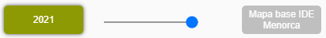
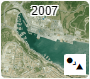
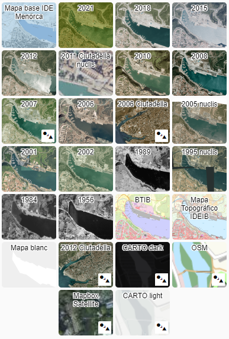
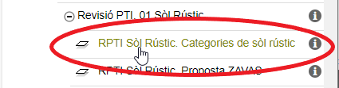
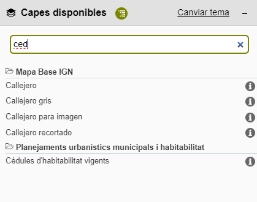
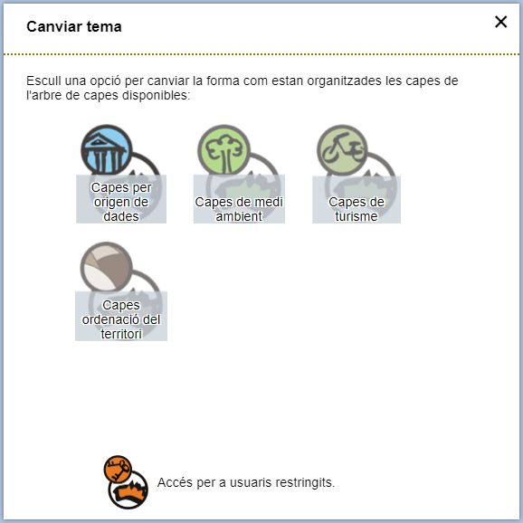
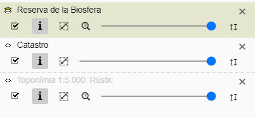

# 2. Panell de capes

El panell de capes és a la banda dreta de la pantalla i és el lloc des d'on es tria el
mapa de fons, es busquen capes d'informació i es gestionen les que ja s'han carregat.

Per defecte apareix desplegat. Es contreu amb el botó de tancament i es torna a obrir
amb el botó de panell de capes.

## 2.1. Capçalera del panell

<figure markdown>
  { .captura }
</figure>

Conté l'enllaç **ajuda** i els selectors d'idioma. Es descriuen a
[Ajuda i idioma](01-interficie.md#17-ajuda-i-idioma).

## 2.2. Mapes de fons

Un mapa de fons és una imatge cartogràfica que serveix de suport per situar la
informació sobre el territori. Té dos propòsits: aportar informació per si mateix i fer
de base per a la resta de capes.

En obrir el visor es carreguen **dos** mapes de fons alhora: el mapa base de l'IDE
Menorca i l'ortofoto de 2021. Només se'n veu un perquè el control lliscant està
desplaçat del tot cap a un costat.

<figure markdown>
  { .captura }
  <figcaption>El control lliscant alterna la transparència entre els dos mapes de fons.</figcaption>
</figure>

Per canviar-ne un:

1. Selecciona primer el mapa de fons que vols substituir (el de l'esquerra o el de la dreta del control lliscant).
2. Tria després el mapa de fons nou de la graella de miniatures.

El control lliscant permet fondre progressivament un mapa amb l'altre, cosa que va molt
bé per comparar dues èpoques del mateix indret.

!!! tip "Comparar ortofotos"
    Carregar dues ortofotos de dates diferents i moure el control lliscant és la manera
    més ràpida de veure com ha canviat una zona.

### Compatibilitat de sistemes de coordenades

Si el visor està en un sistema de coordenades diferent del que fa servir un mapa de
fons, a la miniatura d'aquell mapa hi apareix un símbol amb una fletxa. En seleccionar-lo,
el visor canvia automàticament al sistema de referència compatible.

<figure markdown>
  { .captura }
</figure>

### Mapes de fons disponibles

<figure markdown>
  { .captura }
</figure>

!!! warning "A revisar: el llistat ha quedat endarrerit"
    L'ortofoto més recent d'aquesta llista és la de **2021**, que era la darrera quan es
    va escriure el manual original. Cal comprovar quines ortofotos ofereix avui el visor
    i afegir-hi les que falten abans de publicar aquesta pàgina.

??? note "Llistat complet de mapes de fons"

    **Cartografia base**

    - **Mapa base IDE Menorca**: base de referència de l'IDE Menorca, dividida en capes
      d'urbà, de rústic i de toponímia. Prové de la MTB 1:5.000 de 2002 i la MTB 1:1.000
      de 2004 del Govern de les Illes Balears. Inclou la guia de carrers oficial dels
      vuit municipis de Menorca.
    - **BTIB**: mapa base de les Illes Balears, cartografia a totes les escales.
    - **Base topogràfica de l'illa de Menorca 2012**: actualització de la cartografia de
      2008 amb la fotografia aèria de 2012.
    - **Mapa blanc**: relleu en gris de Menorca, Eivissa, Formentera i Mallorca.
    - **CARTO dark**: base topogràfica amb esquema de colors fosc que ressalta el relleu.
    - **CARTO light**: base topogràfica amb esquema de colors clars.
    - **OSM**: OpenStreetMap. Representació col·laborativa de carreteres, edificis i
      punts d'interès.
    - **Mapbox Satellite**: imatges de satèl·lit d'alta resolució.

    **Ortofotografia de tota l'illa**

    - **2021**: 25 cm/píxel, vol GSD 25 cm fet entre el 17 de maig i el 26 de juny de 2021.
    - **2018**: 15 cm/píxel, vol GSD18 fet entre el 18 i el 23 d'abril de 2018 per a
      Menorca, Eivissa, Formentera i la meitat nord-oest de Mallorca.
    - **2015**: mosaic de les Illes Balears, vol GSD22 d'abril-maig de 2015. Forma part
      del Pla Nacional d'Ortofotografia Aèria (PNOA). Quatre bandes RGBI, GSD 25 cm,
      8 bits per banda.
    - **2012**: mosaic de les Illes Balears, vol GSD22 d'abril-maig de 2012 (PNOA).
      Quatre bandes RGBI, GSD 25 cm.
    - **2010**: mosaic 2010-2011, vol GSD22 de setembre de 2010 a abril de 2011 (PNOA).
    - **2008**: mosaic de les Illes Balears, vol de juliol a octubre de 2008 (PNOA).
    - **2007**: fotografia de 2007 ortorectificada de Menorca.
    - **2006**: mosaic de les Illes Balears, vol de juliol a octubre de 2006 (PNOA).
    - **2002**: mosaic de les Illes Balears, vol de juliol a octubre de 2002.
    - **2001**: fotografies aèries georeferenciades de les Illes Balears.
    - **1989**: mosaic 1989-90, 50 cm/píxel, vol analògic 1:22.000. Blanc i negre.
    - **1984**: mosaic de 50 cm/píxel, vol analògic 1:22.000. Blanc i negre.
    - **1956**: mosaic del vol de 1956-57 (Vol Americà), del Govern de les Illes Balears
      i el Centro Cartográfico y Fotográfico del EA – MINISDEF, dins el Sistema
      Cartogràfic Nacional ([scne.es](https://www.scne.es)).

    **Ortofotografia de nuclis i municipis concrets**

    - **2012 Ciutadella**: ortofotografia del municipi de Ciutadella de 2012.
    - **2011 Ciutadella nuclis**: escala 1:1.000 de les zones urbanes de Ciutadella, a
      partir del vol fotogramètric digital GSD 9 cm de 2011, imatges TIFF RGB. Feta dins
      el projecte «Actualització de la cartografia a escala 1:1.000 de Ciutadella».
    - **2006 Ciutadella**: ortofotografia del municipi de Ciutadella de 2006.
    - **2005 nuclis**: ortofotografia de nuclis de 2004-2005-2006 de les Illes Balears.
    - **1995 nuclis**: fotografies georeferenciades de nuclis de 1995.

## 2.3. Buscar i afegir capes

El menú **Capes disponibles** permet buscar capes procedents de l'IDE Menorca i d'altres
serveis de cartografia (IDEIB, IGN, Cadastre i altres). Hi ha dues maneres d'afegir-les.

### Per l'arbre de capes

L'arbre presenta la informació organitzada per temàtiques. S'obre desplegat i es navega
amb els botons d'expandir i contreure nodes.

<figure markdown>
  { .captura }
</figure>

La forma del cursor indica què pots fer:

| Cursor | Significat |
|---|---|
| Mà | La capa o el grup de capes es pot afegir al mapa |
| Selecció de text | Aquest node no es pot afegir; expandeix-lo per veure les capes que conté |

Si una capa ja està afegida al mapa, el seu nom apareix **ressaltat en verd**.

### Pel cercador de capes

L'altra manera és prémer la icona de la lupa, que obre una caixa de cerca.

<figure markdown>
  { .captura }
</figure>

A partir del **tercer caràcter** comencen a sortir resultats. La cerca mira tant el
títol com la descripció de cada capa. La llista mostra el nom de les capes trobades i
de quin servei prové cadascuna. Per afegir-ne una, prem-ne el títol.

Les capes que ja són al mapa surten en cursiva i, en passar-hi per sobre, mostren el
missatge «La capa ja està afegida». En aquest cas no es poden tornar a afegir.

## 2.4. Canviar de tema

El panell permet canviar el **tema** del visor: refresca l'aplicació amb un arbre de
capes diferent. Cada tema pot canviar quines capes hi ha disponibles, com estan
organitzades, quines eines s'ofereixen i quins mapes de fons hi ha.

<figure markdown>
  { .captura }
</figure>

Prem l'enllaç **Canviar tema** i tria'n un de la finestra que s'obre. En seleccionar-lo,
el visor es refresca amb la configuració nova.

Els temes que ofereix el visor són:

- Capes per origen de dades
- Capes de medi ambient
- Capes de turisme
- Capes d'ordenació del territori
- Accés per a usuaris restringits

!!! note "Pendent de redactar"
    Convindria explicar breument què conté cada tema, perquè l'usuari pugui triar sense
    haver-los d'obrir tots. L'accés per a usuaris restringits es documentarà al
    [manual del visor restringit](../visor-restringit/index.md).

## 2.5. Capes carregades

Aquest menú gestiona les capes que ja has afegit al mapa. Per defecte apareix buit.

Quan el menú està plegat i hi ha capes carregades, un **cercle verd** n'indica el
nombre. Al seu costat, una creu permet eliminar-les totes de cop, amb confirmació prèvia.

<figure markdown>
  { .captura }
  <figcaption>Cada capa carregada mostra el seu títol i les eines per interactuar-hi.</figcaption>
</figure>

!!! tip "Capes en gris"
    Si el títol d'una capa apareix en gris clar, és que a l'escala actual no es dibuixa.
    Apropa't fins que passi a negre.

### Icones de cada capa

| Icona | Nom | Què fa |
|---|---|---|
| Capes apilades | **Grup de capes** | Indica que la capa carregada és un grup de capes simples. La caixa apareix en verd; en passar-hi per sobre es mostren les capes que el componen |
| Rombe | **Capa simple** | Indica que és una capa individual |
| **i** | **Informació de la capa** | Obre les metadades: identificador, URL del servei, descripció de la capa i del servei, persona de contacte i altres dades |
| Casella | **Visibilitat** | Activa o desactiva la visualització de la capa o grup |
| Marc amb fletxa | **Zoom a l'extensió de la capa** | Ajusta el mapa a l'extensió màxima de la capa |
| Fletxes verticals | **Canviar l'ordre** | Prem i arrossega amunt o avall per reordenar les capes |
| Lupa | **Consultes** | Obre les [cerques alfanumèriques i gràfiques](05-consultes.md) |
| Creu | **Eliminar capa** | Treu la capa o el grup del mapa |
| Barra lliscant | **Transparència** | Arrossega cap a l'esquerra per augmentar la transparència i cap a la dreta per reduir-la. Les capes es carreguen sense transparència |
