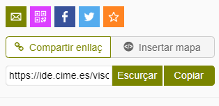
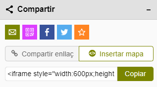

# 3.4. Compartir

Genera un enllaç a la vista actual del visor, o el codi per incrustar-la en una pàgina
web. L'enllaç conserva l'estat complet: escala, extensió, mapes de fons, capes
carregades, objectes seleccionats, dibuixos, cerques i fitxers afegits.

<figure markdown>
  { .captura }
</figure>

## Compartir enllaç

| Icona | Acció |
|---|---|
| Sobre | Envia l'enllaç a la vista del mapa per correu electrònic |
| Codi QR | Genera un QR per obrir el mapa des d'un dispositiu mòbil |
| Facebook | Comparteix el mapa a Facebook |
| X | Comparteix el mapa a X (abans Twitter) |
| Estrella | Afegeix el mapa als marcadors del navegador |
| **Copiar** | Copia l'enllaç al porta-retalls |
| **Escurçar** | Escurça l'URL amb el servei TinyURL |

!!! warning "URL massa llargues"
    Com que l'enllaç conté tot l'estat del visor, pot arribar a ser molt llarg. Si
    l'escurçador no el pot processar, surt aquest missatge:

    > La URL és massa llarga per a ser processada pel servei d'escurçament d'URL.
    > Intenti eliminar alguna capa, desactivar rutes o esborrar dibuixos o el resultat
    > de la cerca i torni-ho a provar.

    La solució és reduir el que hi ha carregat abans de compartir.

## Insertar mapa

La pestanya **Insertar mapa** genera el codi HTML d'una etiqueta `<iframe>` per
incrustar el visor en una pàgina web, amb la mida que indiquis.

<figure markdown>
  { .captura }
</figure>

!!! tip "Incrustar el visor en aquest lloc web"
    Si vols posar un visor dins d'una pàgina d'aquest portal, no enganxis el codi tal
    com surt: fa servir una amplada i una alçada fixes en píxels i es desmuntaria en
    pantalles petites. Copia'n només l'URL i posa-la dins del contenidor responsiu del
    lloc:

    ```html
    <div class="iframe-wrap">
      <iframe src="ENGANXA-AQUÍ-L-URL" allowfullscreen loading="lazy"></iframe>
    </div>
    ```

!!! warning "L'URL ha de ser https"
    Aquest lloc web se serveix per HTTPS, i els navegadors bloquegen els iframes que
    apuntin a `http://`. Comprova que l'URL que copies del visor comenci per `https://`.

## On surt també aquesta eina

La funció de compartir reapareix, amb el mateix funcionament, dins dels resultats de la
[selecció gràfica d'elements](../04-seleccio-grafica.md), tant per al conjunt de
resultats com per a una entitat concreta.
