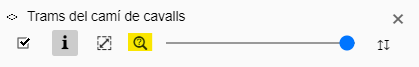
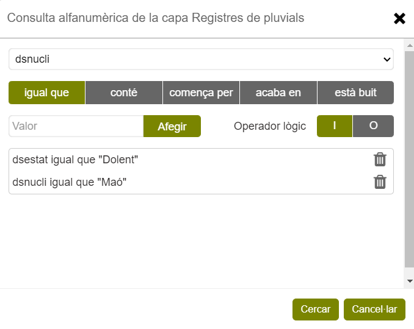
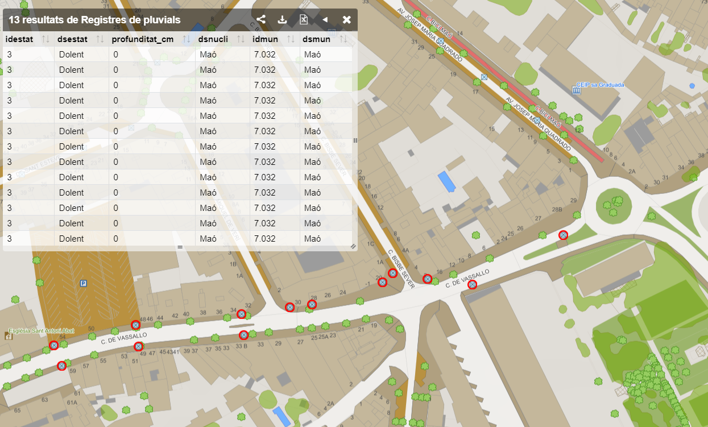
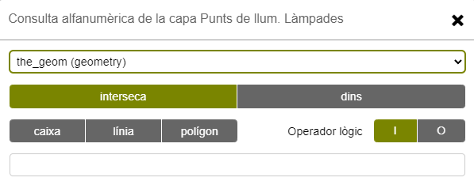

# 5. Consultes

Mentre la [selecció gràfica](04-seleccio-grafica.md) busca **on és** una cosa, les
consultes busquen **quines** compleixen una condició. Es basen en expressions sobre els
atributs de les capes carregades i s'hi poden combinar filtres espacials.

La consulta selecciona i centra al mapa els objectes que compleixen els criteris, i en
mostra els atributs en una taula.

## 5.1. Obrir una consulta

S'accedeix des del panell de **capes carregades**, amb el botó de la lupa de la capa
que vulguis consultar.

<figure markdown>
  { .captura }
</figure>

Si la capa és en realitat un **grup de capes**, el visor et demanarà primer sobre quina
capa concreta vols consultar.

## 5.2. Construir la consulta

1. **Tria l'atribut.** S'obre un diàleg amb el llistat d'atributs de la capa.
2. **Tria el criteri.** Les opcions depenen del tipus d'atribut.
3. **Indica el valor**, prem **Afegir** i després **Cercar**.

<figure markdown>
  { .captura }
</figure>

### Criteris segons el tipus d'atribut

=== "Text"

    - igual que
    - conté
    - comença per
    - acaba en
    - està buit

=== "Numèric"

    - igual que
    - no és igual a
    - major que
    - menor que
    - major o igual que
    - menor o igual que

=== "Data"

    !!! note "Pendent de redactar"
        El manual original deixa aquest punt sense resoldre: hi diu literalment «falta
        trobar un camp tipus data». Cal localitzar una capa amb un atribut de data,
        comprovar quins criteris ofereix el visor i documentar-los.

!!! tip "La cerca de text és predictiva"
    En atributs de text, el visor va suggerint valors existents a mesura que escrius, i
    no distingeix entre majúscules i minúscules.

### Combinar criteris

Els criteris es poden encadenar amb els operadors lògics **i** i **o**, fent servir
atributs diferents i criteris diferents.

**Exemple.** A la capa «Registres de pluvials», buscar els registres del nucli urbà de
Maó que estiguin en mal estat:

```text
dsestat  igual que  "Dolent"
i
dsnucli  igual que  "Maó"
```

**Exemple.** A la capa «Punts de llum. Làmpades», buscar les làmpades de vapor de més de
200 W (n'hi ha de «Vapor de Mercuri / VM» i de «Vapor de Sodi d'Alta Pressió / VSAP»):

```text
tecnologia        conté      "Vapor"
i
potencia_watios   major que  200
```

## 5.3. Els resultats

<figure markdown>
  { .captura }
  <figcaption>Els elements que compleixen els criteris queden ressaltats en vermell.</figcaption>
</figure>

Els resultats surten en una taula, centrats al mapa i ressaltats en vermell. En prémer
una fila de la taula, el mapa se situa sobre aquell element.

Si la consulta no troba res, apareix el missatge «No hi ha resultats».

!!! tip "Veure només els resultats"
    Desactiva la visibilitat de la capa al panell de capes carregades: al mapa hi
    quedaran només els elements trobats.

Els resultats es poden descarregar com a taula o en format geogràfic: KML, GML, GeoJSON,
WKT, Shapefile, GeoPackage o GPX. Aquest darrer només està disponible si la capa és de
tipus lineal.

## 5.4. Afegir un filtre espacial

A la consulta per atributs s'hi pot afegir un criteri espacial. Per fer-ho, tria
l'atribut **`the_geom` (geometry)** del llistat d'atributs.

<figure markdown>
  { .captura }
</figure>

| Criteri | Què selecciona |
|---|---|
| **Interseca** | Les entitats que toquen la caixa, línia o polígon dibuixat |
| **Dins** | Només les entitats íntegrament contingudes dins la caixa o polígon. Amb aquest criteri, la consulta per línia es desactiva |

Després de triar el criteri, cal dibuixar sobre el mapa la caixa, línia o polígon que
farà de filtre. S'activa un menú d'eines de dibuix equivalent al de
[dibuixar i mesurar](03-eines/01-dibuixar-mesurar.md): començar l'edició, desfer vèrtex,
refer vèrtex, acabar el dibuix i cancel·lar.

Els criteris espacials també es poden combinar amb els operadors **i** i **o**.

!!! note "Pendent de redactar"
    El manual original s'atura aquí amb una anotació de «per fer». Falta documentar,
    com a mínim, un exemple complet de consulta amb filtre espacial i què passa quan es
    combinen criteris alfanumèrics i espacials a la mateixa consulta.
